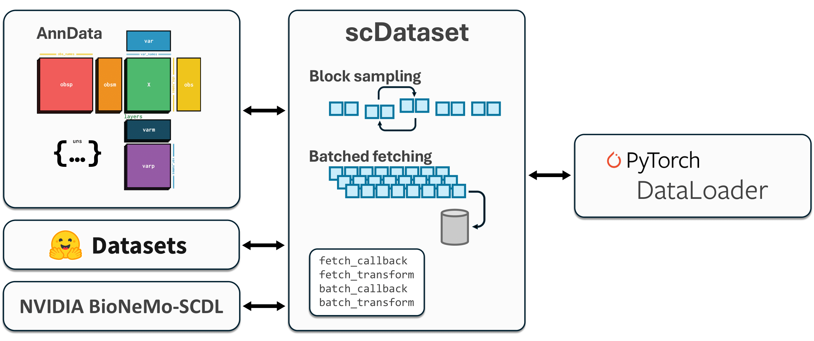

# Benchmarks

This folder contains utilities and scripts for benchmarking `scDataset` against other data loading approaches.

**"scDataset: Scalable Data Loading for Deep Learning on Large-Scale Single-Cell Omics"**



## Installation

Install the required dependencies using:

```bash
pip install -r requirements.txt
```

## Dataset

We benchmarked scDataset on the Tahoe 100M dataset, which is available in three formats:

- **AnnData**: 14 files of approximately 7 million cells each. Download from the [official GitHub](https://github.com/ArcInstitute/arc-virtual-cell-atlas).
- **HuggingFace Datasets**: Download from [HuggingFace](https://huggingface.co/datasets/tahoebio/Tahoe-100M).
- **BioNeMo**: Generate using the [official conversion script](https://nvidia.github.io/bionemo-framework/API_reference/bionemo/scdl/scripts/convert_h5ad_to_scdl/).

## Running Experiments

To run experiments, use:

```bash
./run_experiments.sh
```

Experiment settings can be configured using the YAML files in the experiment folder. Dataset folders can be configured in the `evaluate_scdataset.py` script.

---

## Utilities (`utils.py`)

### Transform Functions

```python
from utils import hf_tahoe_to_tensor, adata_to_mindex
```

#### `hf_tahoe_to_tensor(batch, num_genes=62713)`
Transform function for HuggingFace sparse gene expression data.

Converts sparse gene/expression pairs to dense numpy arrays.

**Parameters:**
- `batch`: HuggingFace batch dictionary with 'genes' and 'expressions' keys
- `num_genes`: Total number of genes (default: 62713 for Tahoe dataset)

**Returns:**
- Dense numpy array of shape (batch_size, num_genes)

#### `adata_to_mindex(batch, columns=None)`
Transform function for AnnData/AnnCollection data.

Materializes backed AnnData to memory and converts sparse matrices to dense.

**Parameters:**
- `batch`: AnnData object (possibly backed)
- `columns`: List of observation column names to include

**Returns:**
- `MultiIndexable` with 'X' and any requested columns

**Example:**
```python
from functools import partial

# Create transform with specific columns
transform = partial(adata_to_mindex, columns=['cell_type', 'batch'])
```

### Callback Functions

#### `bionemo_to_tensor(data_collection, idx)`
Fetch callback for BioNeMo's sparse matrix format.

Handles both single index and array index access for BioNeMo SingleCellCollection.

### Configuration

#### `load_config(config_path)`
Load experiment configuration from YAML file.

**Returns:**
- Dictionary with configuration parameters

### Evaluation

#### `evaluate_loader(loader, total_samples, batch_size, warmup=10, max_batches=None)`
Evaluate the throughput of a data loader.

**Parameters:**
- `loader`: PyTorch DataLoader to evaluate
- `total_samples`: Total number of samples in the dataset
- `batch_size`: Batch size being used
- `warmup`: Number of warmup batches to skip (default: 10)
- `max_batches`: Maximum batches to process (default: all)

**Returns:**
- Dictionary with timing and throughput metrics:
  - `total_time`: Total evaluation time in seconds
  - `samples_per_second`: Throughput in samples/second
  - `batches_processed`: Number of batches processed
  - `mean_batch_time`: Average time per batch

#### `save_results_to_csv(results, output_path)`
Save evaluation results to CSV file.

**Parameters:**
- `results`: List of result dictionaries
- `output_path`: Path to save CSV file

## Tested Strategies

The benchmark evaluates these `scDataset` sampling strategies:

1. **Streaming**: Sequential access, no shuffling
2. **BlockShuffling**: Shuffled block access
3. **BlockWeightedSampling**: Weighted sampling with block access
4. **ClassBalancedSampling**: Class-balanced sampling

## Comparison Baselines

The benchmarks can also compare against:

- Native PyTorch DataLoader with random sampling
- HuggingFace Datasets streaming
- BioNeMo SingleCellCollection
- Plain iteration over data

## Output Format

Results are saved as CSV with columns:
- `strategy`: Name of the sampling strategy
- `batch_size`: Batch size used
- `fetch_factor`: Fetch factor (for scDataset)
- `num_workers`: Number of DataLoader workers
- `total_time`: Total evaluation time
- `samples_per_second`: Throughput
- `batches_processed`: Number of batches evaluated
- `mean_batch_time`: Average time per batch- `avg_batch_entropy`: Average batch entropy (measures cross-source mixing)
- `std_batch_entropy`: Standard deviation of batch entropy

## Plotting Results

The benchmark includes plotting utilities to generate publication-quality figures.

### Using the Notebook

Open and run `plots.ipynb` to interactively generate all plots:

```bash
jupyter notebook plots.ipynb
```

### Using the Command Line

Generate all standard plots at once:

```bash
python plot_utils.py --generate-all
```

### Programmatic Usage

```python
from plot_utils import plot_throughput, plot_batch_entropy

# Throughput plot
plot_throughput(
    csv_path='experiments/block_size_fetch_factor_eval_anncollection_random.csv',
    title='scDataset Throughput with AnnData',
    save_path='figures/throughput_anndata.pdf'
)

# Batch entropy plot
plot_batch_entropy(
    csv_path='experiments/block_size_fetch_factor_eval_anncollection_random.csv',
    title='scDataset Batch Entropy',
    save_path='figures/batch_entropy_anndata.pdf'
)
```

### Available Plot Functions

- `plot_throughput()`: Create throughput plots (samples/sec vs block size)
- `plot_batch_entropy()`: Create batch entropy plots (shuffling quality analysis)
- `plot_block_size_by_fetch_factor()`: General-purpose plotting function
- `generate_all_benchmark_plots()`: Generate all standard plots at once
